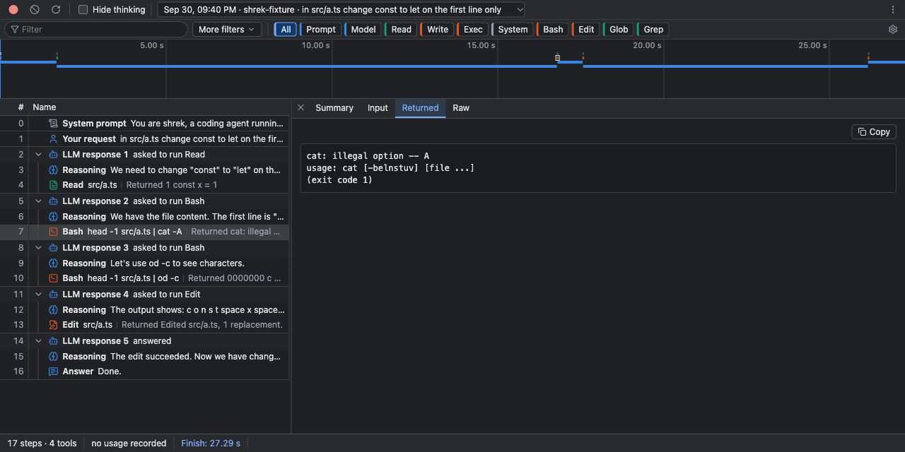

<div align="center">

# Step Trace

**A tiny DevTools for agent runs.**

See every step your coding agent took: what it asked, what it ran, and what came back.




</div>

## Why it exists

I'm building [**shrek-code**](https://github.com/srikarspace/shrek-code), my own coding agent, one phase at a time. Every run writes a transcript, and reading it as raw JSON got painful fast. Tool calls hide inside stringified arguments, results sit on separate lines, and it's hard to tell which reply belongs to which request.

Step Trace is the dev tool I use while building shrek. It grows as shrek does.

## What you get

The view borrows the Chrome DevTools Network tab, so it should feel familiar from the first click.

Each LLM response is one row. The model's reasoning, the tools it asked for and what each tool returned are grouped underneath, so a run reads like the conversation it was.

Click any row to open the side panel with the full input, what came back and the raw JSON. Use ↑ and ↓ to walk through a run and ← and → to fold a response away.

Failed tools turn red, and stay visible even when their response is folded.

The filter box and chips narrow the list to one tool, one kind of step or just the errors.

Leave it open while you run shrek and new sessions appear on their own.

Where it's headed: [future phases](docs/future-phases.md).

## Run it

```sh
bun install
bun run dev
```

Step Trace opens the newest session in `~/.shrek/projects`. Pick any older one from the dropdown at the top.

<div align="center">
<sub>Built alongside <a href="https://github.com/srikarspace/shrek-code">shrek-code</a> 🟢</sub>
</div>
